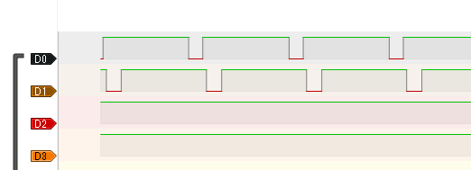
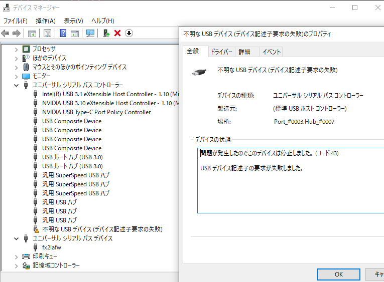

# 作成編

日が開いてしまった。
とりあえずありものが動くか試す。

## 復習

まず復習を兼ねて、bootloaderを焼いてみる。
まずリセットボタンに近いピンを1にする。これで永続DFUモードにする。
この状態でコマンドを実行する。dfu-utilを使う。st-flashは使わない。

	$ dfu-util -a 2 -D generic_boot20_pc13.bin
	dfu-util 0.9

	Copyright 2005-2009 Weston Schmidt, Harald Welte and OpenMoko Inc.
	Copyright 2010-2016 Tormod Volden and Stefan Schmidt
	This program is Free Software and has ABSOLUTELY NO WARRANTY
	Please report bugs to http://sourceforge.net/p/dfu-util/tickets/

	Invalid DFU suffix signature
	A valid DFU suffix will be required in a future dfu-util release!!!
	Opening DFU capable USB device...
	ID 1eaf:0003
	Run-time device DFU version 0110
	Claiming USB DFU Interface...
	Setting Alternate Setting #2 ...
	Determining device status: state = dfuIDLE, status = 0
	dfuIDLE, continuing
	DFU mode device DFU version 0110
	Device returned transfer size 1024
	Copying data from PC to DFU device
	Download        [=========================] 100%         7172 bytes
	Download done.
	state(8) = dfuMANIFEST-WAIT-RESET, status(0) = No error condition is present
	Done!

できている。

## 既存のファームウェアを試す

githubのqmk_firmwareを検索すると
rule.mkの中に`MCU = STM32F103`とあるキーボードが見つかる。
とりあえずこれをコンパイルしてやってみる。

今回は[ergodox_stm32](https://github.com/qmk/qmk_firmware/tree/master/keyboards/ergodox_stm32)を使ってみる。

	$ make ergodox_stm32:default
	省略
	$ make ergodox_stm32:default:dfu-util
	QMK Firmware 0.8.72
	Making ergodox_stm32 with keymap default and target dfu-util

	arm-none-eabi-gcc.exe (GNU Tools for ARM Embedded Processors 6-2017-q2-update) 6.3.1 20170620 (release) [ARM/embedded-6-branch revision 249437]
	Copyright (C) 2016 Free Software Foundation, Inc.
	This is free software; see the source for copying conditions.  There is NO
	warranty; not even for MERCHANTABILITY or FITNESS FOR A PARTICULAR PURPOSE.

	Size before:
	   text    data     bss     dec     hex filename
		  0   44674       0   44674    ae82 .build/ergodox_stm32_default.hex

	Size after:
	   text    data     bss     dec     hex filename
		  0   44674       0   44674    ae82 .build/ergodox_stm32_default.hex

	Copying ergodox_stm32_default.bin to qmk_firmware folder                                            [OK]
	dfu-util 0.9

	Copyright 2005-2009 Weston Schmidt, Harald Welte and OpenMoko Inc.
	Copyright 2010-2016 Tormod Volden and Stefan Schmidt
	This program is Free Software and has ABSOLUTELY NO WARRANTY
	Please report bugs to http://sourceforge.net/p/dfu-util/tickets/

	Opening DFU capable USB device...
	ID 1eaf:0003
	Run-time device DFU version 0110
	Claiming USB DFU Interface...
	Setting Alternate Setting #0 ...
	Determining device status: state = dfuIDLE, status = 0
	dfuIDLE, continuing
	DFU mode device DFU version 0110
	Device returned transfer size 1024
	Could not read name, sscanf returned 0
	Failed to parse memory layout
	make[1]: *** [tmk_core/chibios.mk:285: dfu-util] エラー 74
	Make finished with errors
	make: *** [Makefile:579: ergodox_stm32:default:dfu-util] エラー 1

ダメっぽい...  
他のを試してみる。 [Ortho 75](https://github.com/qmk/qmk_firmware/tree/master/keyboards/cannonkeys/ortho75)

	$ make cannonkeys/ortho75:default:dfu-util
	QMK Firmware 0.8.72
	Making cannonkeys/ortho75 with keymap default and target dfu-util

	arm-none-eabi-gcc.exe (GNU Tools for ARM Embedded Processors 6-2017-q2-update) 6.3.1 20170620 (release) [ARM/embedded-6-branch revision 249437]
	Copyright (C) 2016 Free Software Foundation, Inc.
	This is free software; see the source for copying conditions.  There is NO
	warranty; not even for MERCHANTABILITY or FITNESS FOR A PARTICULAR PURPOSE.

	Size before:
	   text    data     bss     dec     hex filename
		  0   38142       0   38142    94fe .build/cannonkeys_ortho75_default.hex

	Compiling: tmk_core/common/command.c                                                                [OK]
	Linking: .build/cannonkeys_ortho75_default.elf                                                      [OK]
	Creating binary load file for flashing: .build/cannonkeys_ortho75_default.bin                       [OK]
	Creating load file for flashing: .build/cannonkeys_ortho75_default.hex                              [OK]

	Size after:
	   text    data     bss     dec     hex filename
		  0   38142       0   38142    94fe .build/cannonkeys_ortho75_default.hex

	Copying cannonkeys_ortho75_default.bin to qmk_firmware folder                                       [OK]
	dfu-util 0.9

	Copyright 2005-2009 Weston Schmidt, Harald Welte and OpenMoko Inc.
	Copyright 2010-2016 Tormod Volden and Stefan Schmidt
	This program is Free Software and has ABSOLUTELY NO WARRANTY
	Please report bugs to http://sourceforge.net/p/dfu-util/tickets/

	Opening DFU capable USB device...
	ID 1eaf:0003
	Run-time device DFU version 0110
	Claiming USB DFU Interface...
	Setting Alternate Setting #2 ...
	Determining device status: state = dfuIDLE, status = 0
	dfuIDLE, continuing
	DFU mode device DFU version 0110
	Device returned transfer size 1024
	Copying data from PC to DFU device
	Download    [=========================] 100%        38144 bytes
	Download done.
	state(8) = dfuMANIFEST-WAIT-RESET, status(0) = No error condition is present
	Done!
	Resetting USB to switch back to runtime mode

お [Ortho 75](https://github.com/qmk/qmk_firmware/tree/master/keyboards/cannonkeys/ortho75) はできたっぽい。  
回路はないのでBluePillのみで、  
USBを抜き差しするとちゃんとキーボードとして認識された。  
B10とB12をつなぐと1111111111111と入力された。

### 調べる

https://github.com/qmk/qmk_firmware/blob/7bf9d9dc0ace46fa5ef2b159636f808fcd0d7938/keyboards/cannonkeys/ortho75/config.h#L32 に

	#define MATRIX_COL_PINS { B11, B10, B1, B0, A7, A6, A5, B14, A15, A0, C15, C14, B7, B6, B5 }
	#define MATRIX_ROW_PINS { B12, C13, A2, A1, A3 }
	#define DIODE_DIRECTION COL2ROW

とあるので、とりあえずB12,C13,B11,B10にロジアナをあててみた。

B12とC13にスキャンの信号が負論理で来ていることがわかる。  
ちなみにスキャン間隔は271usだった。  
qmk_firmwareの `#define DIODE_DIRECTION COL2ROW` は負論理だとROWがスキャン側になることがわかる。  
電子云々は無視して、+から-に電気が流れるとすると、  
ROW側の電圧をCOLより低くしてCOLからROWに電気を流す感じだ。  
fennelは間違ってダイオードを反対に実装したのでROW2COLにする\_(:3 」∠ )\_  

## [Ortho 75](https://github.com/qmk/qmk_firmware/tree/master/keyboards/cannonkeys/ortho75)をベースに書き換えてみる

[別リポジトリ xcd0/fennel](https://github.com/xcd0/fennel/tree/master/fennel) にもろもろ用意した。

このリポジトリの`./build.sh`をたたくと私の環境ではビルドされて書き込みが走るようになっている。

	$ make ortho75:default:dfu-util
	QMK Firmware 0.8.72
	Making ortho75 with keymap default and target dfu-util

	arm-none-eabi-gcc.exe (GNU Tools for ARM Embedded Processors 6-2017-q2-update) 6.3.1 20170620 (release) [ARM/embedded-6-
	branch revision 249437]
	Copyright (C) 2016 Free Software Foundation, Inc.
	This is free software; see the source for copying conditions.  There is NO
	warranty; not even for MERCHANTABILITY or FITNESS FOR A PARTICULAR PURPOSE.

	Size before:
	   text    data     bss     dec     hex filename
		  0   38158       0   38158    950e .build/ortho75_default.hex

	Compiling: keyboards/cannonkeys/bluepill/led.c                                                      [OK]
	Compiling: keyboards/cannonkeys/bluepill/keyboard.c                                                 [OK]
	Compiling: keyboards/ortho75/ortho75.c                                                              [OK]
	Compiling: keyboards/ortho75/keymaps/default/keymap.c                                               [OK]
	Compiling: quantum/quantum.c                                                                        [OK]
	Compiling: quantum/keymap_common.c                                                                  [OK]
	Compiling: quantum/keycode_config.c                                                                 [OK]
	Compiling: quantum/matrix_common.c                                                                  [OK]
	Compiling: quantum/matrix.c                                                                         [OK]
	Compiling: quantum/debounce/sym_g.c                                                                 [OK]
	Compiling: tmk_core/common/chibios/eeprom_stm32.c                                                   [OK]
	Compiling: tmk_core/common/chibios/flash_stm32.c                                                    [OK]
	Compiling: quantum/color.c                                                                          [OK]
	Compiling: quantum/rgblight.c                                                                       [OK]
	Compiling: quantum/process_keycode/process_rgb.c                                                    [OK]
	Compiling: quantum/backlight/backlight.c                                                            [OK]
	Compiling: quantum/process_keycode/process_backlight.c                                              [OK]
	Compiling: keyboards/cannonkeys/bluepill/ws2812.c                                                   [OK]
	Compiling: quantum/led_tables.c                                                                     [OK]
	Compiling: quantum/encoder.c                                                                        [OK]
	Compiling: quantum/process_keycode/process_space_cadet.c                                            [OK]
	Compiling: quantum/process_keycode/process_magic.c                                                  [OK]
	Compiling: quantum/process_keycode/process_grave_esc.c                                              [OK]
	Compiling: tmk_core/common/host.c                                                                   [OK]
	Compiling: tmk_core/common/keyboard.c                                                               [OK]
	Compiling: tmk_core/common/action.c                                                                 [OK]
	Compiling: tmk_core/common/action_tapping.c                                                         [OK]
	Compiling: tmk_core/common/action_macro.c                                                           [OK]
	Compiling: tmk_core/common/action_layer.c                                                           [OK]
	Compiling: tmk_core/common/action_util.c                                                            [OK]
	Compiling: tmk_core/common/print.c                                                                  [OK]
	Compiling: tmk_core/common/debug.c                                                                  [OK]
	Compiling: tmk_core/common/util.c                                                                   [OK]
	Compiling: tmk_core/common/eeconfig.c                                                               [OK]
	Compiling: tmk_core/common/report.c                                                                 [OK]
	Compiling: tmk_core/common/chibios/suspend.c                                                        [OK]
	Compiling: tmk_core/common/chibios/timer.c                                                          [OK]
	Compiling: tmk_core/common/chibios/bootloader.c                                                     [OK]
	Compiling: tmk_core/common/chibios/printf.c                                                         [OK]
	Compiling: tmk_core/common/magic.c                                                                  [OK]
	Compiling: tmk_core/common/mousekey.c                                                               [OK]
	Compiling: tmk_core/common/command.c                                                                [OK]
	Compiling: tmk_core/common/chibios/sleep_led.c                                                      [OK]
	Compiling: tmk_core/protocol/chibios/usb_main.c                                                     [OK]
	Compiling: tmk_core/protocol/chibios/main.c                                                         [OK]
	Compiling: tmk_core/protocol/usb_descriptor.c                                                       [OK]
	Compiling: tmk_core/protocol/chibios/usb_driver.c                                                   [OK]
	Compiling: lib/chibios/os/oslib/src/chmboxes.c                                                      [OK]
	Compiling: lib/chibios/os/oslib/src/chmemcore.c                                                     [OK]
	Compiling: lib/chibios/os/oslib/src/chmemheaps.c                                                    [OK]
	Compiling: lib/chibios/os/oslib/src/chmempools.c                                                    [OK]
	Compiling: lib/chibios/os/oslib/src/chpipes.c                                                       [OK]
	Compiling: lib/chibios/os/oslib/src/chfactory.c                                                     [OK]
	Compiling: lib/chibios/os/common/startup/ARMCMx/compilers/GCC/crt1.c                                [OK]
	Compiling: lib/chibios/os/rt/src/chsys.c                                                            [OK]
	Compiling: lib/chibios/os/rt/src/chdebug.c                                                          [OK]
	Compiling: lib/chibios/os/rt/src/chtrace.c                                                          [OK]
	Compiling: lib/chibios/os/rt/src/chvt.c                                                             [OK]
	Compiling: lib/chibios/os/rt/src/chschd.c                                                           [OK]
	Compiling: lib/chibios/os/rt/src/chthreads.c                                                        [OK]
	Compiling: lib/chibios/os/rt/src/chtm.c                                                             [OK]
	Compiling: lib/chibios/os/rt/src/chstats.c                                                          [OK]
	Compiling: lib/chibios/os/rt/src/chregistry.c                                                       [OK]
	Compiling: lib/chibios/os/rt/src/chsem.c                                                            [OK]
	Compiling: lib/chibios/os/rt/src/chmtx.c                                                            [OK]
	Compiling: lib/chibios/os/rt/src/chcond.c                                                           [OK]
	Compiling: lib/chibios/os/rt/src/chevents.c                                                         [OK]
	Compiling: lib/chibios/os/rt/src/chmsg.c                                                            [OK]
	Compiling: lib/chibios/os/rt/src/chdynamic.c                                                        [OK]
	Compiling: lib/chibios/os/common/ports/ARMCMx/chcore.c                                              [OK]
	Compiling: lib/chibios/os/common/ports/ARMCMx/chcore_v7m.c                                          [OK]
	Compiling: lib/chibios/os/hal/osal/rt/osal.c                                                        [OK]
	Compiling: lib/chibios/os/hal/src/hal.c                                                             [OK]
	Compiling: lib/chibios/os/hal/src/hal_buffers.c                                                     [OK]
	Compiling: lib/chibios/os/hal/src/hal_queues.c                                                      [OK]
	Compiling: lib/chibios/os/hal/src/hal_mmcsd.c                                                       [OK]
	Compiling: lib/chibios/os/hal/src/hal_adc.c                                                         [OK]
	Compiling: lib/chibios/os/hal/src/hal_can.c                                                         [OK]
	Compiling: lib/chibios/os/hal/src/hal_crypto.c                                                      [OK]
	Compiling: lib/chibios/os/hal/src/hal_dac.c                                                         [OK]
	Compiling: lib/chibios/os/hal/src/hal_gpt.c                                                         [OK]
	Compiling: lib/chibios/os/hal/src/hal_i2c.c                                                         [OK]
	Compiling: lib/chibios/os/hal/src/hal_i2s.c                                                         [OK]
	Compiling: lib/chibios/os/hal/src/hal_icu.c                                                         [OK]
	Compiling: lib/chibios/os/hal/src/hal_mac.c                                                         [OK]
	Compiling: lib/chibios/os/hal/src/hal_mmc_spi.c                                                     [OK]
	Compiling: lib/chibios/os/hal/src/hal_pal.c                                                         [OK]
	Compiling: lib/chibios/os/hal/src/hal_pwm.c                                                         [OK]
	Compiling: lib/chibios/os/hal/src/hal_rtc.c                                                         [OK]
	Compiling: lib/chibios/os/hal/src/hal_sdc.c                                                         [OK]
	Compiling: lib/chibios/os/hal/src/hal_serial.c                                                      [OK]
	Compiling: lib/chibios/os/hal/src/hal_serial_usb.c                                                  [OK]
	Compiling: lib/chibios/os/hal/src/hal_sio.c                                                         [OK]
	Compiling: lib/chibios/os/hal/src/hal_spi.c                                                         [OK]
	Compiling: lib/chibios/os/hal/src/hal_st.c                                                          [OK]
	Compiling: lib/chibios/os/hal/src/hal_trng.c                                                        [OK]
	Compiling: lib/chibios/os/hal/src/hal_uart.c                                                        [OK]
	Compiling: lib/chibios/os/hal/src/hal_usb.c                                                         [OK]
	Compiling: lib/chibios/os/hal/src/hal_wdg.c                                                         [OK]
	Compiling: lib/chibios/os/hal/src/hal_wspi.c                                                        [OK]
	Compiling: lib/chibios/os/hal/ports/common/ARMCMx/nvic.c                                            [OK]
	Compiling: lib/chibios/os/hal/ports/STM32/STM32F1xx/stm32_isr.c                                     [OK]
	Compiling: lib/chibios/os/hal/ports/STM32/STM32F1xx/hal_lld.c                                       [OK]
	Compiling: lib/chibios/os/hal/ports/STM32/STM32F1xx/hal_adc_lld.c                                   [OK]
	Compiling: lib/chibios/os/hal/ports/STM32/LLD/CANv1/hal_can_lld.c                                   [OK]
	Compiling: lib/chibios/os/hal/ports/STM32/LLD/DACv1/hal_dac_lld.c                                   [OK]
	Compiling: lib/chibios/os/hal/ports/STM32/LLD/DMAv1/stm32_dma.c                                     [OK]
	Compiling: lib/chibios/os/hal/ports/STM32/LLD/GPIOv1/hal_pal_lld.c                                  [OK]
	Compiling: lib/chibios/os/hal/ports/STM32/LLD/I2Cv1/hal_i2c_lld.c                                   [OK]
	Compiling: lib/chibios/os/hal/ports/STM32/LLD/RTCv1/hal_rtc_lld.c                                   [OK]
	Compiling: lib/chibios/os/hal/ports/STM32/LLD/SDIOv1/hal_sdc_lld.c                                  [OK]
	Compiling: lib/chibios/os/hal/ports/STM32/LLD/SPIv1/hal_i2s_lld.c                                   [OK]
	Compiling: lib/chibios/os/hal/ports/STM32/LLD/SPIv1/hal_spi_lld.c                                   [OK]
	Compiling: lib/chibios/os/hal/ports/STM32/LLD/TIMv1/hal_st_lld.c                                    [OK]
	Compiling: lib/chibios/os/hal/ports/STM32/LLD/TIMv1/hal_gpt_lld.c                                   [OK]
	Compiling: lib/chibios/os/hal/ports/STM32/LLD/TIMv1/hal_icu_lld.c                                   [OK]
	Compiling: lib/chibios/os/hal/ports/STM32/LLD/TIMv1/hal_pwm_lld.c                                   [OK]
	Compiling: lib/chibios/os/hal/ports/STM32/LLD/USARTv1/hal_serial_lld.c                              [OK]
	Compiling: lib/chibios/os/hal/ports/STM32/LLD/USARTv1/hal_uart_lld.c                                [OK]
	Compiling: lib/chibios/os/hal/ports/STM32/LLD/USBv1/hal_usb_lld.c                                   [OK]
	Compiling: lib/chibios/os/hal/ports/STM32/LLD/xWDGv1/hal_wdg_lld.c                                  [OK]
	Compiling: drivers/boards/STM32_F103_STM32DUINO/board.c                                             [OK]
	Compiling: lib/chibios/os/hal/lib/streams/chprintf.c                                                [OK]
	Compiling: lib/chibios/os/hal/lib/streams/memstreams.c                                              [OK]
	Compiling: lib/chibios/os/hal/lib/streams/nullstreams.c                                             [OK]
	Compiling: lib/chibios/os/various/syscalls.c                                                        [OK]
	Linking: .build/ortho75_default.elf                                                                 [OK]
	Creating binary load file for flashing: .build/ortho75_default.bin                                  [OK]
	Creating load file for flashing: .build/ortho75_default.hex                                         [OK]

	Size after:
	   text    data     bss     dec     hex filename
		  0   38166       0   38166    9516 .build/ortho75_default.hex

	Copying ortho75_default.bin to qmk_firmware folder                                                  [OK]
	ERROR: Bootloader not found. Trying again in 5s.
	ERROR: Bootloader not found. Trying again in 5s.
	dfu-util 0.9

	Copyright 2005-2009 Weston Schmidt, Harald Welte and OpenMoko Inc.
	Copyright 2010-2016 Tormod Volden and Stefan Schmidt
	This program is Free Software and has ABSOLUTELY NO WARRANTY
	Please report bugs to http://sourceforge.net/p/dfu-util/tickets/

	Opening DFU capable USB device...
	ID 1eaf:0003
	Run-time device DFU version 0110
	Claiming USB DFU Interface...
	Setting Alternate Setting #2 ...
	Determining device status: state = dfuIDLE, status = 0
	dfuIDLE, continuing
	DFU mode device DFU version 0110
	Device returned transfer size 1024
	Copying data from PC to DFU device
	Download    [=========================] 100%        38168 bytes
	Download done.
	state(8) = dfuMANIFEST-WAIT-RESET, status(0) = No error condition is present
	Done!
	Resetting USB to switch back to runtime mode

書き込まれた。  
ただリセットされてもUSBがエラーになる。  

いじった個所はconfig.hの

	#define MANUFACTURER xcd0
	#define PRODUCT fennel
	#define DESCRIPTION fennel
	
	/* key matrix size */
	//#define MATRIX_ROWS 5
	//#define MATRIX_COLS 15
	#define MATRIX_ROWS 5
	#define MATRIX_COLS 16
	
	//#define MATRIX_COL_PINS { B11, B10, B1, B0, A7, A6, A5, B14, A15, A0, C15, C14, B7, B6, B5 }
	//#define MATRIX_ROW_PINS { B12, C13, A2, A1, A3 }
	
	#define MATRIX_ROW_PINS { B9, B8, B7, B6, B5  }
	#define MATRIX_COL_PINS { A7, A4, A5, A6, B0, B1, A1, A0 }
	//#define UNUSED_PINS { B10, B11, B13, B14, B15, A8 }
	
	//#define DIODE_DIRECTION COL2ROW
	#define DIODE_DIRECTION ROW2COL
	
	#define BACKLIGHT_LEVELS 6
	#define BACKLIGHT_BREATHING
	#define BREATHING_PERIOD 6
	
	//#define ENCODERS_PAD_A { B9 }
	//#define ENCODERS_PAD_B { B8 }
	#define ENCODERS_PAD_A { B10 }
	#define ENCODERS_PAD_B { B11 }

この箇所と
ortho75.hのLAYOUTマクロを１列足したことと

	#define LAYOUT( \
		k00, k01, k02, k03, k04, k05, k06, k07, k08, k09, k0a, k0b, k0c, k0d, k0e, k0f, \
		k10, k11, k12, k13, k14, k15, k16, k17, k18, k19, k1a, k1b, k1c, k1d, k1e, k1f, \
		k20, k21, k22, k23, k24, k25, k26, k27, k28, k29, k2a, k2b, k2c, k2d, k2e, k2f, \
		k30, k31, k32, k33, k34, k35, k36, k37, k38, k39, k3a, k3b, k3c, k3d, k3e, k3f, \
		k40, k41, k42, k43, k44, k45, k46, k47, k48, k49, k4a, k4b, k4c, k4d, k4e, k4f \
	) \
	{ \
		{ k00, k01, k02, k03, k04, k05, k06, k07, k08, k09, k0a, k0b, k0c, k0d, k0e, k0f }, \
		{ k10, k11, k12, k13, k14, k15, k16, k17, k18, k19, k1a, k1b, k1c, k1d, k1e, k1f }, \
		{ k20, k21, k22, k23, k24, k25, k26, k27, k28, k29, k2a, k2b, k2c, k2d, k2e, k2f }, \
		{ k30, k31, k32, k33, k34, k35, k36, k37, k38, k39, k3a, k3b, k3c, k3d, k3e, k3f }, \
		{ k40, k41, k42, k43, k44, k45, k46, k47, k48, k49, k4a, k4b, k4c, k4d, k4e, k4f }, \
	}

と、キーマップに1列足したことである。

ディスコードで聞いてみた。

[takashiski今日 00:05
とりあえず MATRIX_COLSで定義したピン数とMATRIX_COL_PINSで定義してるピンの数が違うのが気になります。ビルドできるんです？](https://discordapp.com/channels/376937950409392130/635679787905712148/693475758299021382)

とのことだったので使っていないピンをとりあえず割り当ててみた。
左右分離にする予定だったので片手5x8で、両手でCOLが16になる想定にしていた。

	#define MATRIX_COL_PINS { A7, A4, A5, A6, B0, B1, A1, A0,    B10, B11, B12, B13, B14, B15, A8 }

この状態でとりあえずビルドした。

	QMK Firmware 0.8.72
	Making ortho75 with keymap default

	arm-none-eabi-gcc.exe (GNU Tools for ARM Embedded Processors 6-2017-q2-update) 6.3.1 20170620 (release) [ARM/embedded-6-
	branch revision 249437]
	Copyright (C) 2016 Free Software Foundation, Inc.
	This is free software; see the source for copying conditions.  There is NO
	warranty; not even for MERCHANTABILITY or FITNESS FOR A PARTICULAR PURPOSE.

	Size before:
	   text    data     bss     dec     hex filename
		  0   38142       0   38142    94fe .build/ortho75_default.hex

	Compiling: keyboards/cannonkeys/bluepill/led.c                                                      [OK]
	Compiling: keyboards/cannonkeys/bluepill/keyboard.c                                                 [OK]
	Compiling: keyboards/ortho75/ortho75.c                                                              [OK]
	Compiling: keyboards/ortho75/keymaps/default/keymap.c                                               [OK]
	Compiling: quantum/quantum.c                                                                        [OK]
	Compiling: quantum/keymap_common.c                                                                  [OK]
	Compiling: quantum/keycode_config.c                                                                 [OK]
	Compiling: quantum/matrix_common.c                                                                  [OK]
	Compiling: quantum/matrix.c                                                                         [OK]
	Compiling: quantum/debounce/sym_g.c                                                                 [OK]
	Compiling: tmk_core/common/chibios/eeprom_stm32.c                                                   [OK]
	Compiling: tmk_core/common/chibios/flash_stm32.c                                                    [OK]
	Compiling: quantum/color.c                                                                          [OK]
	Compiling: quantum/rgblight.c                                                                       [OK]
	Compiling: quantum/process_keycode/process_rgb.c                                                    [OK]
	Compiling: quantum/backlight/backlight.c                                                            [OK]
	Compiling: quantum/process_keycode/process_backlight.c                                              [OK]
	Compiling: keyboards/cannonkeys/bluepill/ws2812.c                                                   [OK]
	Compiling: quantum/led_tables.c                                                                     [OK]
	Compiling: quantum/encoder.c                                                                        [OK]
	Compiling: quantum/process_keycode/process_space_cadet.c                                            [OK]
	Compiling: quantum/process_keycode/process_magic.c                                                  [OK]
	Compiling: quantum/process_keycode/process_grave_esc.c                                              [OK]
	Compiling: tmk_core/common/host.c                                                                   [OK]
	Compiling: tmk_core/common/keyboard.c                                                               [OK]
	Compiling: tmk_core/common/action.c                                                                 [OK]
	Compiling: tmk_core/common/action_tapping.c                                                         [OK]
	Compiling: tmk_core/common/action_macro.c                                                           [OK]
	Compiling: tmk_core/common/action_layer.c                                                           [OK]
	Compiling: tmk_core/common/action_util.c                                                            [OK]
	Compiling: tmk_core/common/print.c                                                                  [OK]
	Compiling: tmk_core/common/debug.c                                                                  [OK]
	Compiling: tmk_core/common/util.c                                                                   [OK]
	Compiling: tmk_core/common/eeconfig.c                                                               [OK]
	Compiling: tmk_core/common/report.c                                                                 [OK]
	Compiling: tmk_core/common/chibios/suspend.c                                                        [OK]
	Compiling: tmk_core/common/chibios/timer.c                                                          [OK]
	Compiling: tmk_core/common/chibios/bootloader.c                                                     [OK]
	Compiling: tmk_core/common/chibios/printf.c                                                         [OK]
	Compiling: tmk_core/common/magic.c                                                                  [OK]
	Compiling: tmk_core/common/mousekey.c                                                               [OK]
	Compiling: tmk_core/common/command.c                                                                [OK]
	Compiling: tmk_core/common/chibios/sleep_led.c                                                      [OK]
	Compiling: tmk_core/protocol/chibios/usb_main.c                                                     [OK]
	Compiling: tmk_core/protocol/chibios/main.c                                                         [OK]
	Compiling: tmk_core/protocol/usb_descriptor.c                                                       [OK]
	Compiling: tmk_core/protocol/chibios/usb_driver.c                                                   [OK]
	Compiling: lib/chibios/os/oslib/src/chmboxes.c                                                      [OK]
	Compiling: lib/chibios/os/oslib/src/chmemcore.c                                                     [OK]
	Compiling: lib/chibios/os/oslib/src/chmemheaps.c                                                    [OK]
	Compiling: lib/chibios/os/oslib/src/chmempools.c                                                    [OK]
	Compiling: lib/chibios/os/oslib/src/chpipes.c                                                       [OK]
	Compiling: lib/chibios/os/oslib/src/chfactory.c                                                     [OK]
	Compiling: lib/chibios/os/common/startup/ARMCMx/compilers/GCC/crt1.c                                [OK]
	Compiling: lib/chibios/os/rt/src/chsys.c                                                            [OK]
	Compiling: lib/chibios/os/rt/src/chdebug.c                                                          [OK]
	Compiling: lib/chibios/os/rt/src/chtrace.c                                                          [OK]
	Compiling: lib/chibios/os/rt/src/chvt.c                                                             [OK]
	Compiling: lib/chibios/os/rt/src/chschd.c                                                           [OK]
	Compiling: lib/chibios/os/rt/src/chthreads.c                                                        [OK]
	Compiling: lib/chibios/os/rt/src/chtm.c                                                             [OK]
	Compiling: lib/chibios/os/rt/src/chstats.c                                                          [OK]
	Compiling: lib/chibios/os/rt/src/chregistry.c                                                       [OK]
	Compiling: lib/chibios/os/rt/src/chsem.c                                                            [OK]
	Compiling: lib/chibios/os/rt/src/chmtx.c                                                            [OK]
	Compiling: lib/chibios/os/rt/src/chcond.c                                                           [OK]
	Compiling: lib/chibios/os/rt/src/chevents.c                                                         [OK]
	Compiling: lib/chibios/os/rt/src/chmsg.c                                                            [OK]
	Compiling: lib/chibios/os/rt/src/chdynamic.c                                                        [OK]
	Compiling: lib/chibios/os/common/ports/ARMCMx/chcore.c                                              [OK]
	Compiling: lib/chibios/os/common/ports/ARMCMx/chcore_v7m.c                                          [OK]
	Compiling: lib/chibios/os/hal/osal/rt/osal.c                                                        [OK]
	Compiling: lib/chibios/os/hal/src/hal.c                                                             [OK]
	Compiling: lib/chibios/os/hal/src/hal_buffers.c                                                     [OK]
	Compiling: lib/chibios/os/hal/src/hal_queues.c                                                      [OK]
	Compiling: lib/chibios/os/hal/src/hal_mmcsd.c                                                       [OK]
	Compiling: lib/chibios/os/hal/src/hal_adc.c                                                         [OK]
	Compiling: lib/chibios/os/hal/src/hal_can.c                                                         [OK]
	Compiling: lib/chibios/os/hal/src/hal_crypto.c                                                      [OK]
	Compiling: lib/chibios/os/hal/src/hal_dac.c                                                         [OK]
	Compiling: lib/chibios/os/hal/src/hal_gpt.c                                                         [OK]
	Compiling: lib/chibios/os/hal/src/hal_i2c.c                                                         [OK]
	Compiling: lib/chibios/os/hal/src/hal_i2s.c                                                         [OK]
	Compiling: lib/chibios/os/hal/src/hal_icu.c                                                         [OK]
	Compiling: lib/chibios/os/hal/src/hal_mac.c                                                         [OK]
	Compiling: lib/chibios/os/hal/src/hal_mmc_spi.c                                                     [OK]
	Compiling: lib/chibios/os/hal/src/hal_pal.c                                                         [OK]
	Compiling: lib/chibios/os/hal/src/hal_pwm.c                                                         [OK]
	Compiling: lib/chibios/os/hal/src/hal_rtc.c                                                         [OK]
	Compiling: lib/chibios/os/hal/src/hal_sdc.c                                                         [OK]
	Compiling: lib/chibios/os/hal/src/hal_serial.c                                                      [OK]
	Compiling: lib/chibios/os/hal/src/hal_serial_usb.c                                                  [OK]
	Compiling: lib/chibios/os/hal/src/hal_sio.c                                                         [OK]
	Compiling: lib/chibios/os/hal/src/hal_spi.c                                                         [OK]
	Compiling: lib/chibios/os/hal/src/hal_st.c                                                          [OK]
	Compiling: lib/chibios/os/hal/src/hal_trng.c                                                        [OK]
	Compiling: lib/chibios/os/hal/src/hal_uart.c                                                        [OK]
	Compiling: lib/chibios/os/hal/src/hal_usb.c                                                         [OK]
	Compiling: lib/chibios/os/hal/src/hal_wdg.c                                                         [OK]
	Compiling: lib/chibios/os/hal/src/hal_wspi.c                                                        [OK]
	Compiling: lib/chibios/os/hal/ports/common/ARMCMx/nvic.c                                            [OK]
	Compiling: lib/chibios/os/hal/ports/STM32/STM32F1xx/stm32_isr.c                                     [OK]
	Compiling: lib/chibios/os/hal/ports/STM32/STM32F1xx/hal_lld.c                                       [OK]
	Compiling: lib/chibios/os/hal/ports/STM32/STM32F1xx/hal_adc_lld.c                                   [OK]
	Compiling: lib/chibios/os/hal/ports/STM32/LLD/CANv1/hal_can_lld.c                                   [OK]
	Compiling: lib/chibios/os/hal/ports/STM32/LLD/DACv1/hal_dac_lld.c                                   [OK]
	Compiling: lib/chibios/os/hal/ports/STM32/LLD/DMAv1/stm32_dma.c                                     [OK]
	Compiling: lib/chibios/os/hal/ports/STM32/LLD/GPIOv1/hal_pal_lld.c                                  [OK]
	Compiling: lib/chibios/os/hal/ports/STM32/LLD/I2Cv1/hal_i2c_lld.c                                   [OK]
	Compiling: lib/chibios/os/hal/ports/STM32/LLD/RTCv1/hal_rtc_lld.c                                   [OK]
	Compiling: lib/chibios/os/hal/ports/STM32/LLD/SDIOv1/hal_sdc_lld.c                                  [OK]
	Compiling: lib/chibios/os/hal/ports/STM32/LLD/SPIv1/hal_i2s_lld.c                                   [OK]
	Compiling: lib/chibios/os/hal/ports/STM32/LLD/SPIv1/hal_spi_lld.c                                   [OK]
	Compiling: lib/chibios/os/hal/ports/STM32/LLD/TIMv1/hal_st_lld.c                                    [OK]
	Compiling: lib/chibios/os/hal/ports/STM32/LLD/TIMv1/hal_gpt_lld.c                                   [OK]
	Compiling: lib/chibios/os/hal/ports/STM32/LLD/TIMv1/hal_icu_lld.c                                   [OK]
	Compiling: lib/chibios/os/hal/ports/STM32/LLD/TIMv1/hal_pwm_lld.c                                   [OK]
	Compiling: lib/chibios/os/hal/ports/STM32/LLD/USARTv1/hal_serial_lld.c                              [OK]
	Compiling: lib/chibios/os/hal/ports/STM32/LLD/USARTv1/hal_uart_lld.c                                [OK]
	Compiling: lib/chibios/os/hal/ports/STM32/LLD/USBv1/hal_usb_lld.c                                   [OK]
	Compiling: lib/chibios/os/hal/ports/STM32/LLD/xWDGv1/hal_wdg_lld.c                                  [OK]
	Compiling: drivers/boards/STM32_F103_STM32DUINO/board.c                                             [OK]
	Compiling: lib/chibios/os/hal/lib/streams/chprintf.c                                                [OK]
	Compiling: lib/chibios/os/hal/lib/streams/memstreams.c                                              [OK]
	Compiling: lib/chibios/os/hal/lib/streams/nullstreams.c                                             [OK]
	Compiling: lib/chibios/os/various/syscalls.c                                                        [OK]
	Linking: .build/ortho75_default.elf                                                                 [OK]
	Creating binary load file for flashing: .build/ortho75_default.bin                                  [OK]
	Creating load file for flashing: .build/ortho75_default.hex                                         [OK]

	Size after:
	   text    data     bss     dec     hex filename
		  0   38142       0   38142    94fe .build/ortho75_default.hex

	Copying ortho75_default.bin to qmk_firmware folder                                                  [OK]
	(Firmware size check does not yet support cortex-m3 microprocessors; skipping.)

エラーなどはなく、正常にビルドできているように見える。

	dfu-util 0.9

	Copyright 2005-2009 Weston Schmidt, Harald Welte and OpenMoko Inc.
	Copyright 2010-2016 Tormod Volden and Stefan Schmidt
	This program is Free Software and has ABSOLUTELY NO WARRANTY
	Please report bugs to http://sourceforge.net/p/dfu-util/tickets/

	Opening DFU capable USB device...
	ID 1eaf:0003
	Run-time device DFU version 0110
	Claiming USB DFU Interface...
	Setting Alternate Setting #2 ...
	Determining device status: state = dfuIDLE, status = 0
	dfuIDLE, continuing
	DFU mode device DFU version 0110
	Device returned transfer size 1024
	Copying data from PC to DFU device
	Download    [=========================] 100%        38144 bytes
	Download done.
	state(8) = dfuMANIFEST-WAIT-RESET, status(0) = No error condition is present
	Done!
	Resetting USB to switch back to runtime mode

書き込みも正常にできた。
ただ状況は変わらなかった。

