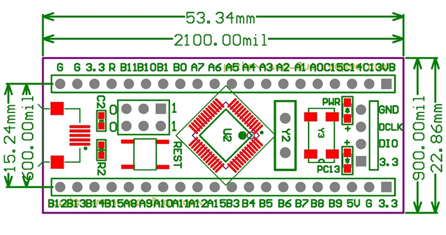

# stm32を使ってみる

Blue Pillといわれる STM32F103C8T6 の乗った安いもりもりマイコンを使ってみる。  
最終的にはキーボード制御に使いたい。

AとかBとかのピンがいっぱいあるのがわかる。  
72MHz駆動の32Bitマイコン。  
厳密にはマイコンじゃなくてMPUらしい(よくしらない)。つまりつよい?。  

| パーツ       | 詳細                                      |
| ---          | ---                                       |
| MCU          | STM32F103 (ARM 32-bit Cortex-M3 CPU Core) |
| CLOCK        | 72MHz (Max)                               |
| VOLTAGE      | 2.0～3.6V                                 |
| DIPで使うPin | 40pin(3.3v,GNDx2,R)                       |
| Flash        | 64KBytes                                  |
| SRAM         | 20KByte                                   |

2年前の資料だが、[KbD Pre APRIL 2018 - 春から始める ARM で自作キーボード](https://booth.pm/ja/items/840614) を参考にちまちまやってみる。

Pro Microよりよさげなところ

* GPIOが多い
* 記憶領域が大きい
* microUSBがもげなさそう
* やっすい

Pro Microより良くないところ

* QMK firmwareの情報が少ない

## 環境

win10 + msys2

macもlinuxもあるので別に何でも構わないのだが、とりあえずこれでいく。

## 購入したもの

| 物             | 説明               | 値段(税別) | 正式名称                                         | URL                                  |
| ---            | ---                | ---        | ---                                              | ---                                  |
| BluePill       | 使うマイコン       | 750円      | DIP化STM32モジュール [STM32-D40]                 | http://www.aitendo.com/product/13348 |
| ST-LINK V2     | ライター           | 500円      | STM8/STM32ライタ [STLINKV2]                      | http://www.aitendo.com/product/16082 |
| ブレッドボード | マイコンとか刺す   | 270円      | ブレッドボード [MB-102]                          | http://www.aitendo.com/product/13803 |
| 導線           | つなぐケーブル     | 200円      | ピンヘッダ用接続ケーブル PS                      | http://www.aitendo.com/product/15275 |
| 抵抗           | 表面実装抵抗1.5kΩ | 100円      | ★0603★チップ抵抗★5%★（20個入） [R0603-5-110] | http://www.aitendo.com/product/9962  |

## やったこと

1. bootloaderを入れた
1. 抵抗を入れ替えた
1. USB経由での書き込みを試みた→まだうまくいかない

## bootloaderの導入

[長くなったので./bootloader/readme.mdに書いた。](./bootloader/readme.md)  

windows用の必要なファイルはbootloaderディレクトリに全部置いている。  
このリポジトリをクローンしているなら、とりあえずこれで書き込める。

	cd bootloader
	./st-flash.exe write generic_boot20_pc13.bin 0x8000000

詳しくは./bootloader/readme.mdを参照。

書き込めるとBluePillがそこそこ早く(0.2秒間隔くらい？)ちかちかする。

https://firtel.blogspot.com/2017/03/blue-pill-stm32duino.html
によると

> USB Bootloaderを書き込んだあとはBoot1のジャンパをもとに戻すのを忘れずに。
> プログラムを何も書き込んでない状態だとずっとDFUモードになるみたいでLEDが点滅した状態になる。

ということでこの点滅はDFUモードなる状態を表しているのかもしれない。

## もしかして回路の製造ミス？

http://jazz-love.ddo.jp/wordpress/2018/08/17/mac-blue-pill%E3%81%A7stm32duino%E3%82%92%E4%BD%BF%E3%81%86%E3%81%9F%E3%82%81%E3%81%AB%E3%83%96%E3%83%BC%E3%83%88%E3%83%AD%E3%83%BC%E3%83%80%E3%83%BC%E3%82%92%E6%9B%B8%E3%81%8D%E8%BE%BC%E3%82%80/  
によると抵抗が間違っているらしい。1.5kΩの表面実装抵抗を持ってないのでaitendoで注文する。

→ 注文した。届いた。入れ替えた。表面実装の半田はしんどい...

## QMKを入れる

KbD Pre APRIL 2018 - 春から始める ARM で自作キーボード https://booth.pm/ja/items/840614  
をそのままなぞる。

	$ git submodule add https://github.com/qmk/qmk_firmware
	$ cd qmk_fimware
	$ git submodule sync --recursive
	$ git submodule update --init --recursive
	$ make chibios_test/stm32_f103_onekey:default
	QMK Firmware 0.8.13
	make: *** No rule to make target 'chibios_test/stm32_f103_onekey:default'. Stop.
	|
	|  QMK's make format recently changed to use folder locations and colons:
	|     make project_folder:keymap[:target]
	|  Examples:
	|     make planck/rev4:default:dfu
	|     make planck:default
	|

あれっもしや...  
https://github.com/qmk/qmk_firmware/tree/master/keyboards/chibios_test/  
404だと...\_(┐「ε:)\_  
２年前はもうだめな模様

## USB経由での書き込み

仕組みの私の現状の理解は、
* bootloaderが0x2000番地以降に書かれる。
* USBをつなぐとbootloaderが起動し、短い期間の間、USBでの書き込みができる状態になる。(これがDFUモード？)
* 特に何もなければ bootloader に設定されている

